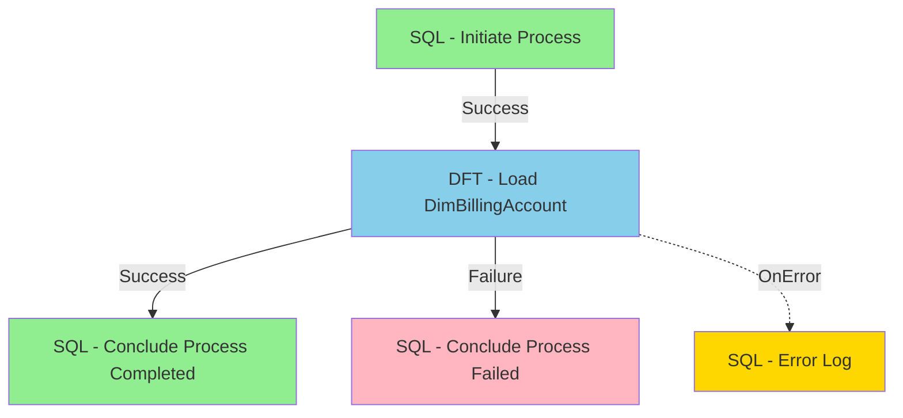
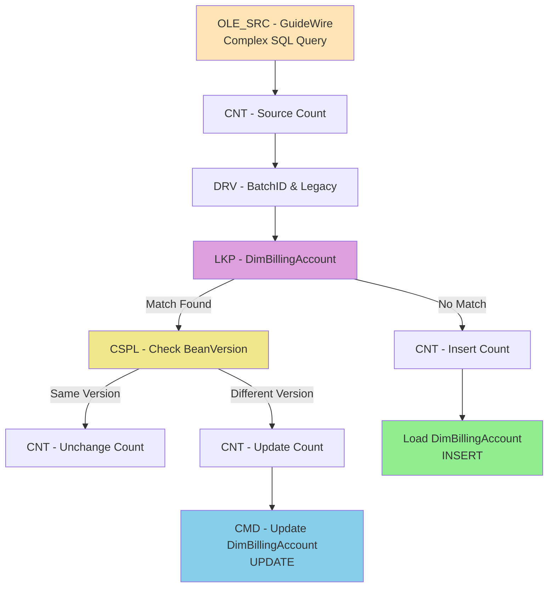
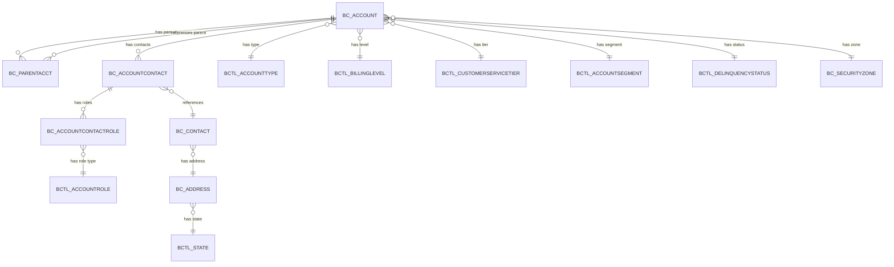
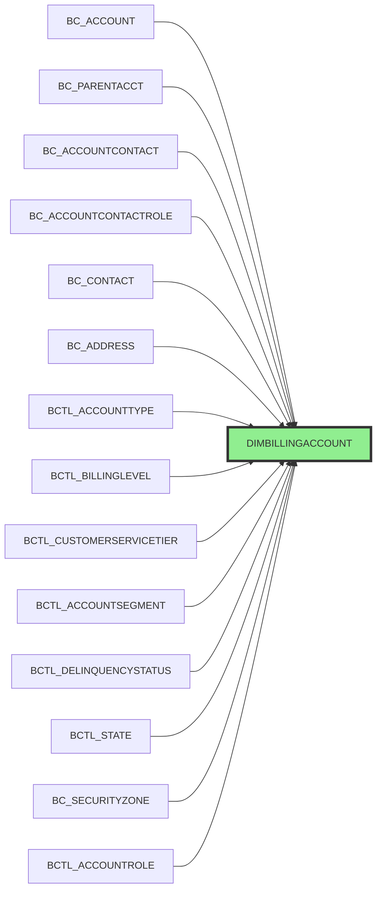

# SSIS Package Documentation: EDW_BC_Load_DimBillingAccount

## Package Overview

**Package Name:** EDW_BC_Load_DimBillingAccount  
**Purpose:** Load and maintain the DimBillingAccount dimension table from GuideWire BillingCenter  
**SCD Type:** Type 1 (Overwrite)  
**Load Pattern:** Incremental (based on UpdateTime)  
**Change Detection:** BeanVersion comparison  
**Source System:** GuideWire BillingCenter  
**Target System:** Enterprise Data Warehouse  

---

## Package Variables

| Variable Name | Data Type | Default Value | Description |
|--------------|-----------|---------------|-------------|
| BatchID | INT32 | 0 | Batch identifier for audit tracking |
| IncrementDays | INT32 | 0 | Number of days to look back for incremental load |
| SourceCount | INT32 | 0 | Count of source records processed |
| InsertCount | INT32 | 0 | Count of records inserted |
| UpdateCount | INT32 | 0 | Count of records updated |
| UnChangeCount | INT32 | 0 | Count of records unchanged |

---

## Control Flow Architecture



### Control Flow Steps

1. **SQL - Initiate Process**
   - Inserts audit record with 'Started' status
   - Records BatchID and start timestamp

2. **DFT - Load DimBillingAccount**
   - Main data flow task (detailed below)

3. **SQL - Conclude Process Completed** (on success)
   - Updates audit record with 'Completed' status
   - Records row counts and completion timestamp

4. **SQL - Conclude Process Failed** (on failure)
   - Updates audit record with 'Failed' status
   - Records partial counts and failure timestamp

5. **SQL - Error Log** (OnError event handler)
   - Logs error details to DMPROC.ERRORLOG

---

## Data Flow Architecture



### Data Flow Components

1. **OLE_SRC - GuideWire**: Source query with CTEs
2. **CNT - Source Count**: Count all source records
3. **DRV - BatchID & Legacy**: Add audit columns
4. **LKP - DimBillingAccount**: Lookup existing records
5. **CSPL - Check BeanVersion**: Detect changes
6. **CNT - Insert/Update/Unchange Count**: Track operations
7. **Load DimBillingAccount**: Insert new records
8. **CMD - Update DimBillingAccount**: Update changed records

---

## Source Tables

### Primary Source Table

#### BC_ACCOUNT
**Description:** Main billing account table from GuideWire BillingCenter

| Column Name | Data Type | Nullable | Description |
|------------|-----------|----------|-------------|
| ID | BIGINT | No | Primary key |
| PUBLICID | VARCHAR(20) | No | Business key |
| ACCOUNTNUMBER | VARCHAR(255) | Yes | Account number |
| ACCOUNTNAME | VARCHAR(255) | Yes | Account name |
| ACCOUNTTYPE | BIGINT | Yes | FK to bctl_accounttype |
| BILLINGLEVEL | BIGINT | Yes | FK to bctl_billinglevel |
| SERVICETIER | BIGINT | Yes | FK to bctl_customerservicetier |
| SECURITYZONEID | BIGINT | Yes | FK to bc_securityzone |
| SEGMENT | BIGINT | Yes | FK to bctl_accountsegment |
| DELINQUENCYSTATUS | BIGINT | Yes | FK to bctl_delinquencystatus |
| CLOSEDATE | TIMESTAMP | Yes | Account close date |
| CREATETIME | TIMESTAMP | Yes | Account creation date |
| BEANVERSION | VARCHAR(20) | Yes | Version for change detection |
| RETIRED | INT | Yes | Soft delete (0=Active, 1=Retired) |
| UPDATETIME | TIMESTAMP | Yes | Last update timestamp |
| FIRSTTWICEPERMTHINVOICEDOM | INT | Yes | Invoice day of month |
| SECONDTWICEPERMTHINVOICEDOM | INT | Yes | Invoice day of month |

---

### Parent Account Information

#### BC_PARENTACCT
**Description:** Parent account relationship table

| Column Name | Data Type | Nullable | Description |
|------------|-----------|----------|-------------|
| OWNERID | BIGINT | No | Child account ID |
| FOREIGNENTITYID | BIGINT | No | Parent account ID |
| BEANVERSION | VARCHAR(20) | Yes | Version control |
| UPDATETIME | TIMESTAMP | Yes | Last update timestamp |

---

### Contact and Address Information

#### BC_ACCOUNTCONTACT
**Description:** Account contact association table

| Column Name | Data Type | Nullable | Description |
|------------|-----------|----------|-------------|
| ID | BIGINT | No | Primary key |
| INSUREDACCOUNTID | BIGINT | Yes | Account ID for insured |
| CONTACTID | BIGINT | Yes | FK to bc_contact |
| BEANVERSION | VARCHAR(20) | Yes | Version control |
| UPDATETIME | TIMESTAMP | Yes | Last update timestamp |

#### BC_ACCOUNTCONTACTROLE
**Description:** Account contact role assignment

| Column Name | Data Type | Nullable | Description |
|------------|-----------|----------|-------------|
| ID | BIGINT | No | Primary key |
| ACCOUNTCONTACTID | BIGINT | No | FK to bc_accountcontact |
| ROLE | BIGINT | Yes | FK to bctl_accountrole |
| BEANVERSION | VARCHAR(20) | Yes | Version control |
| UPDATETIME | TIMESTAMP | Yes | Last update timestamp |

#### BC_CONTACT
**Description:** Contact information table

| Column Name | Data Type | Nullable | Description |
|------------|-----------|----------|-------------|
| ID | BIGINT | No | Primary key |
| FIRSTNAME | VARCHAR(45) | Yes | First name |
| LASTNAME | VARCHAR(45) | Yes | Last name |
| PRIMARYADDRESSID | BIGINT | Yes | FK to bc_address |
| BEANVERSION | VARCHAR(20) | Yes | Version control |
| UPDATETIME | TIMESTAMP | Yes | Last update timestamp |

#### BC_ADDRESS
**Description:** Address information table

| Column Name | Data Type | Nullable | Description |
|------------|-----------|----------|-------------|
| ID | BIGINT | No | Primary key |
| ADDRESSLINE1 | VARCHAR(60) | Yes | Address line 1 |
| ADDRESSLINE2 | VARCHAR(60) | Yes | Address line 2 |
| ADDRESSLINE3 | VARCHAR(60) | Yes | Address line 3 |
| CITY | VARCHAR(50) | Yes | City |
| STATE | BIGINT | Yes | FK to bctl_state |
| POSTALCODE | VARCHAR(50) | Yes | Postal code |
| BEANVERSION | VARCHAR(20) | Yes | Version control |
| UPDATETIME | TIMESTAMP | Yes | Last update timestamp |

---

### Lookup Tables

#### BCTL_ACCOUNTTYPE
| Column | Type | Description |
|--------|------|-------------|
| ID | BIGINT | Primary key |
| NAME | VARCHAR(50) | Account type name |

#### BCTL_BILLINGLEVEL
| Column | Type | Description |
|--------|------|-------------|
| ID | BIGINT | Primary key |
| NAME | VARCHAR(100) | Billing level name |

#### BCTL_CUSTOMERSERVICETIER
| Column | Type | Description |
|--------|------|-------------|
| ID | BIGINT | Primary key |
| NAME | VARCHAR(50) | Service tier name |

#### BCTL_ACCOUNTSEGMENT
| Column | Type | Description |
|--------|------|-------------|
| ID | BIGINT | Primary key |
| NAME | VARCHAR(50) | Segment name |

#### BCTL_DELINQUENCYSTATUS
| Column | Type | Description |
|--------|------|-------------|
| ID | BIGINT | Primary key |
| NAME | VARCHAR(50) | Delinquency status name |

#### BCTL_ACCOUNTROLE
| Column | Type | Description |
|--------|------|-------------|
| ID | BIGINT | Primary key |
| TYPECODE | VARCHAR(50) | Role type code (e.g., 'insured') |

#### BCTL_STATE
| Column | Type | Description |
|--------|------|-------------|
| ID | BIGINT | Primary key |
| NAME | VARCHAR(50) | State name |

#### BC_SECURITYZONE
| Column | Type | Description |
|--------|------|-------------|
| ID | BIGINT | Primary key |
| NAME | VARCHAR(60) | Security zone name |
| BEANVERSION | VARCHAR(20) | Version control |
| UPDATETIME | TIMESTAMP | Last update timestamp |

---

## Source Query Structure

### CTE: ParentAcct
**Purpose:** Retrieve parent account information

```sql
WITH ParentAcct AS (
    SELECT pa.OwnerID,
           CAST(act.AccountNumber AS INT) AS ParentAccountNumber,
           CONCAT(pa.BeanVersion, act.BeanVersion) AS BeanVersion,
           act.UpdateTime
    FROM bc_ParentAcct pa
    JOIN bc_account act ON act.ID = pa.ForeignEntityID
)
```

### CTE: InsuredInfo
**Purpose:** Retrieve insured contact and address information

```sql
InsuredInfo AS (
    SELECT ac.InsuredAccountID AS AccountID,
           c.FirstName,
           c.LastName,
           a.AddressLine1,
           a.AddressLine2,
           a.AddressLine3,
           a.City,
           a.PostalCode,
           tls.NAME AS "State",
           CONCAT(ac.BeanVersion, acr.BeanVersion, c.BeanVersion, a.BeanVersion) AS BeanVersion,
           ac.UpdateTime AS ac_UpdateTime,
           acr.UpdateTime AS acr_UpdateTime,
           c.UpdateTime AS c_UpdateTime,
           a.UpdateTime AS a_UpdateTime
    FROM bc_accountcontact ac
    JOIN bc_accountcontactrole acr ON acr.AccountContactID = ac.ID
    JOIN bctl_accountrole tlar ON tlar.ID = acr.Role
    LEFT JOIN bc_contact c ON c.ID = ac.ContactID
    LEFT JOIN bc_address a ON a.ID = c.PrimaryAddressID
    LEFT JOIN bctl_state tls ON tls.ID = a.State
    WHERE tlar.TYPECODE = 'insured'
)
```

---

## Table Relationships



---

## Joins Documentation

### Main Query Joins

| Join # | Left Table | Right Table | Join Type | Condition | Description |
|--------|-----------|-------------|-----------|-----------|-------------|
| 1 | BC_ACCOUNT | BCTL_ACCOUNTTYPE | LEFT | at.ID = dt.ACCOUNTTYPE | Get account type name |
| 2 | BC_ACCOUNT | ParentAcct CTE | LEFT | ParentAcct.OWNERID = dt.ID | Get parent account info |
| 3 | BC_ACCOUNT | BCTL_BILLINGLEVEL | LEFT | bl.ID = dt.BILLINGLEVEL | Get billing level name |
| 4 | BC_ACCOUNT | BCTL_CUSTOMERSERVICETIER | LEFT | cst.ID = dt.SERVICETIER | Get service tier name |
| 5 | BC_ACCOUNT | BC_SECURITYZONE | LEFT | sz.ID = dt.SECURITYZONEID | Get security zone name |
| 6 | BC_ACCOUNT | InsuredInfo CTE | LEFT | InsuredInfo.ACCOUNTID = dt.ID | Get insured contact info |
| 7 | BC_ACCOUNT | BCTL_DELINQUENCYSTATUS | LEFT | tlds.ID = dt.DELINQUENCYSTATUS | Get delinquency status |
| 8 | BC_ACCOUNT | BCTL_ACCOUNTSEGMENT | LEFT | bas.ID = dt.SEGMENT | Get segment name |

### ParentAcct CTE Joins

| Join # | Left Table | Right Table | Join Type | Condition | Description |
|--------|-----------|-------------|-----------|-----------|-------------|
| 1 | BC_PARENTACCT | BC_ACCOUNT | INNER | act.ID = pa.FOREIGNENTITYID | Get parent account number |

### InsuredInfo CTE Joins

| Join # | Left Table | Right Table | Join Type | Condition | Description |
|--------|-----------|-------------|-----------|-----------|-------------|
| 1 | BC_ACCOUNTCONTACT | BC_ACCOUNTCONTACTROLE | INNER | acr.ACCOUNTCONTACTID = ac.ID | Get contact roles |
| 2 | BC_ACCOUNTCONTACTROLE | BCTL_ACCOUNTROLE | INNER | tlar.ID = acr.ROLE | Filter for insured role |
| 3 | BC_ACCOUNTCONTACT | BC_CONTACT | LEFT | c.ID = ac.CONTACTID | Get contact details |
| 4 | BC_CONTACT | BC_ADDRESS | LEFT | a.ID = c.PRIMARYADDRESSID | Get address details |
| 5 | BC_ADDRESS | BCTL_STATE | LEFT | tls.ID = a.STATE | Get state name |

---

## Transformations

### 1. Row Count - Source
**Component:** CNT - Source Count  
**Type:** ROW_COUNT  
**Purpose:** Count all records from source query  
**Output Variable:** User::SourceCount

### 2. Derived Column
**Component:** DRV - BatchID & Legacy  
**Type:** DERIVED_COLUMN  
**Purpose:** Add audit and system identifier columns

| Output Column | Expression | Data Type |
|--------------|------------|----------|
| BATCHID | @[User::BatchID] | INT |

### 3. Lookup Transformation
**Component:** LKP - DimBillingAccount  
**Type:** LOOKUP  
**Purpose:** Find existing records in dimension table  
**Cache Mode:** Partial (parameterized query)  
**Lookup Query:**
```sql
SELECT PUBLICID, BEANVERSION 
FROM DIMBILLINGACCOUNT
```

**Join Condition:** SOURCE.PUBLICID = LOOKUP.PUBLICID

**Return Columns:**
- BEANVERSION (aliased as EDWBEANVERSION)

**Outputs:**
- **Lookup Match Output**: Records found in dimension (potential updates)
- **Lookup No Match Output**: New records not in dimension (will be inserted)

### 4. Conditional Split
**Component:** CSPL - Check BeanVersion  
**Type:** CONDITIONAL_SPLIT  
**Purpose:** Detect changes using BeanVersion comparison (SCD Type 1)

| Output Name | Condition | Evaluation Order | Description |
|------------|-----------|------------------|-------------|
| SameBeanVersion | BEANVERSION == EDWBEANVERSION | 0 | No changes detected |
| DifferentBeanVersion | DEFAULT | 1 | Changes detected - needs update |

### 5. Row Count - Insert
**Component:** CNT - Insert Count  
**Type:** ROW_COUNT  
**Input:** Lookup No Match Output  
**Output Variable:** User::InsertCount

### 6. Row Count - Update
**Component:** CNT - Update Count  
**Type:** ROW_COUNT  
**Input:** DifferentBeanVersion output  
**Output Variable:** User::UpdateCount

### 7. Row Count - Unchanged
**Component:** CNT - Unchange Count  
**Type:** ROW_COUNT  
**Input:** SameBeanVersion output  
**Output Variable:** User::UnChangeCount

### 8. Incremental Load Filter
**Type:** FILTER (in source query)  
**Purpose:** Load only changed records based on UpdateTime

**Filter Logic:**
```sql
WHERE (
    dt.UPDATETIME >= DATEADD(D, @IncrementDays, CAST(GETDATE() AS DATE)) OR
    ParentAcct.UPDATETIME >= DATEADD(D, @IncrementDays, CAST(GETDATE() AS DATE)) OR
    sz.UPDATETIME >= DATEADD(D, @IncrementDays, CAST(GETDATE() AS DATE)) OR
    InsuredInfo.ac_UPDATETIME >= DATEADD(D, @IncrementDays, CAST(GETDATE() AS DATE)) OR
    InsuredInfo.acr_UPDATETIME >= DATEADD(D, @IncrementDays, CAST(GETDATE() AS DATE)) OR
    InsuredInfo.c_UPDATETIME >= DATEADD(D, @IncrementDays, CAST(GETDATE() AS DATE)) OR
    InsuredInfo.a_UPDATETIME >= DATEADD(D, @IncrementDays, CAST(GETDATE() AS DATE))
)
```

### 9. Role Filter
**Type:** FILTER (in InsuredInfo CTE)  
**Purpose:** Filter for insured contacts only

**Filter Logic:**
```sql
WHERE tlar.TYPECODE = 'insured'
```

---

## Target Table

### DIMBILLINGACCOUNT
**Load Type:** UPSERT (INSERT for new, UPDATE for changed)  
**SCD Type:** Type 1 (Overwrite)  
**Change Detection:** BeanVersion comparison

#### Target Columns

| Column Name | Data Type | Nullable | Source | Description |
|------------|-----------|----------|--------|-------------|
| BILLINGACCOUNTID | INT | No | Auto-generated | Surrogate key |
| PUBLICID | VARCHAR(64) | No | PUBLICID | Business key |
| ACCOUNTNUMBER | VARCHAR(256) | Yes | ACCOUNTNUMBER | Account number |
| ACCOUNTNAME | VARCHAR(256) | Yes | ACCOUNTNAME | Account name |
| ACCOUNTTYPENAME | VARCHAR(50) | Yes | ACCOUNTTYPENAME | Account type |
| PARENTACCOUNTNUMBER | BIGINT | Yes | PARENTACCOUNTNUMBER | Parent account |
| BILLINGLEVELNAME | VARCHAR(100) | Yes | BILLINGLEVELNAME | Billing level |
| SERVICETIERNAME | VARCHAR(50) | Yes | SERVICETIERNAME | Service tier |
| SECURITYZONE | VARCHAR(100) | Yes | SECURITYZONE | Security zone |
| FIRSTNAME | VARCHAR(50) | Yes | FIRSTNAME | Insured first name |
| LASTNAME | VARCHAR(50) | Yes | LASTNAME | Insured last name |
| ADDRESSLINE1 | VARCHAR(100) | Yes | ADDRESSLINE1 | Address line 1 |
| ADDRESSLINE2 | VARCHAR(100) | Yes | ADDRESSLINE2 | Address line 2 |
| ADDRESSLINE3 | VARCHAR(100) | Yes | ADDRESSLINE3 | Address line 3 |
| CITY | VARCHAR(50) | Yes | CITY | City |
| STATE | VARCHAR(50) | Yes | STATE | State |
| POSTALCODE | VARCHAR(50) | Yes | POSTALCODE | Postal code |
| ACCOUNTCLOSEDATE | TIMESTAMP | Yes | ACCOUNTCLOSEDATE | Close date |
| ACCOUNTCREATIONDATE | TIMESTAMP | Yes | ACCOUNTCREATIONDATE | Creation date |
| DELIQUENCYSTATUSNAME | VARCHAR(50) | Yes | DELIQUENCYSTATUSNAME | Delinquency status |
| ISACTIVE | BOOLEAN | Yes | ISACTIVE | Active flag (inverted from RETIRED) |
| BATCHID | BIGINT | Yes | BATCHID | Audit batch ID |
| GWROWNUMBER | BIGINT | Yes | GWROWNUMBER | Source row ID |
| BEANVERSION | VARCHAR(20) | Yes | BEANVERSION | Composite version |
| LEGACYSOURCESYSTEM | VARCHAR(25) | Yes | 'WC' | Source system code |
| SEGMENT | VARCHAR(50) | Yes | SEGMENT | Account segment |
| DATEADDED | TIMESTAMP | Yes | Auto | Insert timestamp |
| DATEUPDATED | TIMESTAMP | Yes | GETDATE() | Update timestamp |
| ADDEDBYUSER | VARCHAR(50) | Yes | - | Audit user |

---

## Load Operations

### INSERT Operation
**Component:** Load DimBillingAccount  
**Method:** Fast Load (Bulk Insert)  
**Source:** Lookup No Match Output (new records)  
**Options:**
- TABLOCK
- CHECK_CONSTRAINTS
- ROWS_PER_BATCH = 10000

**Commit Size:** 10,000 rows

### UPDATE Operation
**Component:** CMD - Update DimBillingAccount  
**Method:** OLE DB Command (row-by-row)  
**Source:** DifferentBeanVersion output (changed records)

**Update Statement:**
```sql
UPDATE DIMBILLINGACCOUNT
SET DATEUPDATED = GETDATE(),
    ACCOUNTCLOSEDATE = ?,
    ACCOUNTCREATIONDATE = ?,
    ACCOUNTNAME = ?,
    ACCOUNTNUMBER = ?,
    ACCOUNTTYPENAME = ?,
    ADDRESSLINE1 = ?,
    ADDRESSLINE2 = ?,
    ADDRESSLINE3 = ?,
    BATCHID = ?,
    BEANVERSION = ?,
    BILLINGLEVELNAME = ?,
    CITY = ?,
    DELIQUENCYSTATUSNAME = ?,
    FIRSTNAME = ?,
    GWROWNUMBER = ?,
    ISACTIVE = ?,
    LASTNAME = ?,
    PARENTACCOUNTNUMBER = ?,
    POSTALCODE = ?,
    SECURITYZONE = ?,
    SEGMENT = ?,
    SERVICETIERNAME = ?,
    STATE = ?
WHERE PUBLICID = ?
  AND LEGACYSOURCESYSTEM = ?
```

---

## Data Lineage



---

## Error Handling

### OnError Event Handler
**Handler:** SQL - Error Log  
**Action:** Log error to DMPROC.ERRORLOG table

**Error Logging SQL:**
```sql
INSERT INTO DMPROC.ERRORLOG (
    CONTROLID,
    BATCHID,
    ERROR_TYPE_CD,
    ERROR_NUMBER,
    ERROR_MESSAGE
)
SELECT CONTROLID,
       ?,  -- BatchID
       'E',
       ?,  -- ErrorCode
       ?   -- ErrorDescription
FROM DMPROC.AUDITREFERENCE
WHERE ETLPACKAGE = ?
```

---

## Audit and Logging

### Audit Tables

#### DMPROC.AUDIT
**Purpose:** Track package execution

| Column | Description |
|--------|-------------|
| CONTROLID | Package identifier |
| BATCHID | Batch identifier |
| STATUS | Started/Completed/Failed |
| INITIATEDTM | Start timestamp |
| CONCLUDEDTM | End timestamp |
| COMPLETEDIND | Success flag |
| SOURCECOUNT | Source record count |
| INSERTCOUNT | Insert count |
| UPDATECOUNT | Update count |
| UNCHANGECOUNT | Unchanged count |

#### DMPROC.AUDITREFERENCE
**Purpose:** Package metadata

| Column | Description |
|--------|-------------|
| CONTROLID | Package identifier |
| ETLPACKAGE | Package name |

#### DMPROC.ERRORLOG
**Purpose:** Error tracking

| Column | Description |
|--------|-------------|
| CONTROLID | Package identifier |
| BATCHID | Batch identifier |
| ERROR_TYPE_CD | Error type |
| ERROR_NUMBER | Error code |
| ERROR_MESSAGE | Error description |

---

## Performance Considerations

### Optimization Strategies

1. **Incremental Load**
   - Uses UpdateTime filter to load only changed records
   - Reduces data volume and processing time

2. **Partial Cache Lookup**
   - Parameterized lookup query
   - Efficient for large dimension tables

3. **Fast Load for Inserts**
   - Bulk insert with TABLOCK
   - Batch size: 10,000 rows
   - Minimizes transaction log overhead

4. **Row-by-Row Updates**
   - OLE DB Command for updates
   - Suitable for small update volumes
   - Consider MERGE statement for high volumes

5. **BeanVersion Change Detection**
   - Composite version field
   - Avoids column-by-column comparison
   - Efficient change detection

### Performance Metrics

| Metric | Tracked By |
|--------|----------|
| Source Records | User::SourceCount |
| New Records | User::InsertCount |
| Updated Records | User::UpdateCount |
| Unchanged Records | User::UnChangeCount |
| Execution Time | AUDIT.INITIATEDTM - CONCLUDEDTM |

---

## Business Rules

### Data Quality Rules

1. **Business Key Uniqueness**
   - PUBLICID must be unique per LEGACYSOURCESYSTEM
   - Enforced by target table constraints

2. **Active Status**
   - ISACTIVE derived from RETIRED field
   - Logic: ISACTIVE = CASE WHEN RETIRED = 0 THEN 1 ELSE 0 END

3. **Insured Contact Filter**
   - Only contacts with role 'insured' are included
   - Filters out other contact types

4. **Version Tracking**
   - BeanVersion is composite of multiple table versions
   - Format: CONCAT(table1.version, table2.version, ...)

5. **Legacy Source System**
   - Hard-coded value: 'WC' (Workers Compensation)
   - Identifies source system

### SCD Type 1 Implementation

- **Change Detection:** BeanVersion comparison
- **Update Strategy:** Overwrite existing values
- **History:** Not preserved (Type 1)
- **Timestamp:** DATEUPDATED tracks last change

---

## Dependencies

### Upstream Dependencies
- GuideWire BillingCenter database
- All source tables must be available
- Lookup tables must be populated

### Downstream Dependencies
- Fact tables using BILLINGACCOUNTID
- Reports using DimBillingAccount
- BI dashboards

### Configuration Dependencies
- Package variables (BatchID, IncrementDays)
- Connection managers (GWStaging, EnterpriseDataWarehouse)
- Audit tables (DMPROC schema)

---

## Execution Summary

### Complexity Assessment
**Overall Complexity:** HIGH

| Aspect | Rating | Notes |
|--------|--------|-------|
| Source Complexity | HIGH | 15 tables, 2 CTEs, complex joins |
| Transformation Complexity | MEDIUM | Lookup, conditional split, derived columns |
| Target Complexity | MEDIUM | UPSERT pattern, SCD Type 1 |
| Error Handling | MEDIUM | Event handlers, audit logging |
| Performance | MEDIUM | Incremental load, partial cache |

### Key Features

✅ Incremental load based on UpdateTime  
✅ SCD Type 1 with BeanVersion change detection  
✅ Comprehensive audit and error logging  
✅ Parent account hierarchy support  
✅ Insured contact and address integration  
✅ Multiple lookup table denormalization  
✅ Fast load for inserts, command for updates  
✅ Row count tracking for all operations  

---

## Maintenance Notes

### Regular Maintenance

1. **Index Maintenance**
   - Rebuild indexes on DIMBILLINGACCOUNT
   - Focus on PUBLICID and LEGACYSOURCESYSTEM

2. **Statistics Update**
   - Update statistics after large loads
   - Improves query performance

3. **Audit Table Cleanup**
   - Archive old audit records
   - Maintain ERRORLOG table

4. **Performance Monitoring**
   - Track execution times
   - Monitor row counts
   - Alert on failures

### Troubleshooting

**Issue:** Slow performance  
**Solution:** Check incremental load filter, verify indexes

**Issue:** High update count  
**Solution:** Review BeanVersion logic, consider MERGE statement

**Issue:** Missing records  
**Solution:** Verify source joins, check role filter

**Issue:** Duplicate keys  
**Solution:** Check PUBLICID uniqueness, verify LEGACYSOURCESYSTEM

---

## Change History

| Version | Date | Author | Description |
|---------|------|--------|-------------|
| 1.0 | - | - | Initial implementation |

---

## Documentation Metadata

**Generated:** 2024  
**Package Version:** 62  
**SSIS Version:** SQL Server 2017 (15.0.2000.93)  
**Documentation Format:** Markdown with Mermaid diagrams  
**Completeness:** COMPREHENSIVE

---

*This documentation was generated from the SSIS .dtsx package file and reflects the exact runtime behavior and data flow logic.*